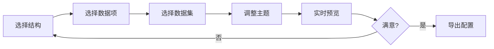

# Dev 环境使用指南

Dev 环境是一个可视化的开发和调试工具，用于快速预览和测试信息图组件。

## 启动开发环境

### 方式一：从项目根目录启动

```bash
npm run dev
```

### 方式二：从 dev 目录启动

```bash
cd packages/dev
npm run dev
```

启动后访问：`http://localhost:5173`

## 界面介绍

Dev 环境提供两个主要 Tab：

### 1. 灵活组合 (Composite)

用于**快速测试和组装设计资产**。

<!--  -->
<!-- TODO: 添加灵活组合界面截图 -->

**功能模块**：

| 模块 | 说明 |
|------|------|
| **结构选择** | 选择任意已注册的结构（list-grid、sequence-timeline 等） |
| **数据项选择** | 选择数据项组件（badge-card、circular-progress 等） |
| **数据集切换** | 切换不同类型的测试数据（列表、层级、对比、SWOT） |
| **主题** | 切换 light / dark 主题 |
| **主题色** | 自定义 colorPrimary |
| **调色板** | 启用/禁用调色板 |

**操作流程**：



**配置持久化**：

- 使用 `localStorage` 保存设置
- 刷新页面后配置保持不变
- 可以随时重置为默认值

### 2. 模板预览 (Preview)

用于**预览和测试内置模板**。

<!--  -->
<!-- TODO: 添加模板预览界面截图 -->

**功能模块**：

| 模块 | 说明 |
|------|------|
| **模板选择** | 浏览所有已注册的模板 |
| **数据集** | 根据模板类型自动适配数据 |
| **主题** | 切换主题 |
| **调色板** | 启用/禁用调色板 |

**配置持久化**：

- 使用 **URL search params** 保存状态
- 支持分享链接（包含完整配置）
- 示例：`http://localhost:5173/?template=process-flow&theme=dark`

## 典型工作流程

### 工作流 1：开发新数据项

```bash
1. 创建文件
   packages/infographic/src/designs/items/MyItem.tsx

2. 实现组件
   # 使用 AI 辅助或手动开发

3. 注册组件
   registerItem('my-item', { component: MyItem });

4. 添加到导出
   # packages/infographic/src/designs/items/index.ts
   export * from './MyItem';

5. 启动 Dev 环境
   npm run dev

6. 在"灵活组合" Tab 测试
   - 选择合适的结构（如 list-column）
   - 数据项选择 "my-item"
   - 选择测试数据
   - 观察效果

7. 调整优化
   - 修改代码
   - 热更新自动刷新
   - 继续测试

8. 完成
```

### 工作流 2：开发新结构

```bash
1. 创建文件
   packages/infographic/src/designs/structures/MyStructure.tsx

2. 实现组件
   # 使用 AI 辅助或手动开发

3. 注册组件
   registerStructure('my-structure', { component: MyStructure });

4. 添加到导出
   # packages/infographic/src/designs/structures/index.ts
   export * from './MyStructure';

5. 启动 Dev 环境
   npm run dev

6. 在"灵活组合" Tab 测试
   - 结构选择 "my-structure"
   - 选择合适的数据项（如 badge-card）
   - 切换不同数据集测试
   - 观察布局效果

7. 测试不同组合
   - 尝试不同的数据项
   - 测试空数据情况
   - 测试大量数据情况
   - 测试主题适配

8. 完成
```

### 工作流 3：测试组合效果

**场景**：想知道 `list-column` 结构 + `progress-card` 数据项的效果。

```bash
1. 打开 Dev 环境

2. 选择"灵活组合" Tab

3. 设置：
   - 结构：list-column
   - 数据项：progress-card
   - 数据集：对比数据

4. 调整主题色
   - 尝试不同的 colorPrimary
   - 切换 light / dark 主题

5. 观察效果
   - 布局是否合理
   - 颜色是否协调
   - 间距是否合适

6. 满意后导出配置（见下节）
```

## 导出配置到模板

当你在 Dev 环境中调试出满意的配置后，可以将其导出为内置模板。

### 步骤

**Step 1：在浏览器控制台查看配置**

打开浏览器开发者工具（F12），在 Console 中查看当前配置：

```javascript
// 在 Composite.tsx 或 Preview.tsx 中，
// 当前配置会以 console.log 形式输出
// 或者手动查看当前状态
```

**Step 2：复制配置对象**

配置格式如下：

```typescript
{
  design: {
    structure: 'list-column',
    item: 'badge-card',
  },
  themeConfig: {
    colorPrimary: '#1890ff',
  },
}
```

**Step 3：打开模板文件**

```bash
packages/infographic/src/templates/built-in.ts
```

**Step 4：添加模板**

```typescript
import { registerTemplate } from './registry';

// 添加你的模板
registerTemplate('my-custom-template', {
  design: {
    structure: 'list-column',
    item: 'badge-card',
  },
  themeConfig: {
    colorPrimary: '#1890ff',
  },
});

// 已有的模板...
registerTemplate('process-flow', { /* ... */ });
```

**Step 5：使用模板**

```typescript
import { Infographic } from '@antv/infographic';

new Infographic({
  container: '#container',
  template: 'my-custom-template',  // 使用你的模板
  data: { /* 数据 */ }
}).render();
```

### 自动导出功能（可选）

可以在 Dev 环境中添加导出按钮：

```tsx
// 在 Composite.tsx 或 Preview.tsx 中添加
<Button
  onClick={() => {
    const config = {
      design: {
        structure: selectedStructure,
        item: selectedItem,
      },
      themeConfig: {
        colorPrimary: colorPrimary,
      },
    };

    console.log('复制以下配置到 built-in.ts：');
    console.log(JSON.stringify(config, null, 2));
  }}
>
  导出配置
</Button>
```

## 数据集说明

Dev 环境提供了多种测试数据集：

### 1. 列表数据 (LIST_DATA)

```typescript
{
  title: '产品特性',
  items: [
    { icon: 'star', label: '易用性', desc: '简单易上手', value: 95 },
    { icon: 'speed', label: '性能', desc: '高性能渲染', value: 90 },
    { icon: 'shield', label: '安全性', desc: '数据安全', value: 98 },
    // ...
  ]
}
```

**适用场景**：列表、网格、横向排列等平铺结构。

### 2. 层级数据 (HIERARCHY_DATA)

```typescript
{
  title: '组织架构',
  items: [
    {
      label: 'CEO',
      children: [
        {
          label: 'CTO',
          children: [
            { label: '前端团队' },
            { label: '后端团队' },
          ]
        },
        // ...
      ]
    }
  ]
}
```

**适用场景**：树形结构、金字塔、层级展示等。

### 3. 对比数据 (COMPARE_DATA)

```typescript
{
  title: '产品对比',
  items: [
    { label: '基础版', value: 99, desc: '个人用户' },
    { label: '专业版', value: 299, desc: '团队使用' },
  ]
}
```

**适用场景**：左右对比、上下对比等对比结构。

### 4. SWOT 数据

```typescript
{
  title: 'SWOT 分析',
  items: [
    { label: '优势', desc: '技术领先' },
    { label: '劣势', desc: '市场占有率低' },
    { label: '机会', desc: '市场需求大' },
    { label: '威胁', desc: '竞争激烈' },
  ]
}
```

**适用场景**：四象限、矩阵等特殊结构。

### 自定义数据

可以在 `packages/dev/src/data.ts` 中添加自定义数据集：

```typescript
export const MY_DATA = {
  title: '自定义数据',
  items: [
    // ...
  ]
};

// 在 Composite.tsx 中添加选项
<Select>
  <Option value="list">列表数据</Option>
  <Option value="hierarchy">层级数据</Option>
  <Option value="compare">对比数据</Option>
  <Option value="custom">自定义数据</Option>
</Select>
```

## 调试技巧

### 1. 实时查看生成的 SVG

打开浏览器开发者工具，查看 DOM 中的 SVG 元素：

```html
<div id="container">
  <svg>
    <!-- 生成的 SVG 内容 -->
  </svg>
</div>
```

### 2. 复制 SVG 代码

右键点击 SVG 元素 → 复制 → Copy outerHTML，可以：
- 粘贴到 SVG 编辑器（如 Figma、Illustrator）
- 保存为 .svg 文件
- 在线预览（https://www.svgviewer.dev/）

### 3. 调整窗口大小

测试响应式表现：
- 缩放浏览器窗口
- 使用浏览器的设备模拟器
- 观察 SVG 的 viewBox 是否正确

### 4. 测试边界情况

- **空数据**：`items: []`
- **单个数据**：`items: [{ label: '唯一项' }]`
- **大量数据**：`items: Array(100).fill({ label: '项' })`
- **长文本**：`label: '这是一个非常长的标签文本...'`
- **缺失字段**：`{ label: '标签' }` （无 icon、value）

### 5. 性能分析

使用浏览器性能工具：
1. 打开 Performance 面板
2. 开始录制
3. 切换配置或数据
4. 停止录制
5. 分析渲染时间

## 常见问题

### Q: 修改代码后没有更新？

A:
1. 检查是否保存文件
2. 查看终端是否有编译错误
3. 尝试手动刷新浏览器（Ctrl/Cmd + R）
4. 检查热更新是否正常工作

### Q: 组件没有出现在选项列表中？

A:
1. 确认已经注册组件（`registerItem` / `registerStructure`）
2. 确认已添加到 `index.ts` 导出
3. 重启 Dev 环境
4. 检查浏览器控制台是否有错误

### Q: 预览效果不正确？

A:
1. 检查数据格式是否匹配
2. 查看浏览器控制台错误
3. 尝试不同的数据项/结构组合
4. 检查组件代码是否有逻辑错误

### Q: 如何分享预览效果？

A:
1. 使用"模板预览" Tab（配置在 URL 中）
2. 复制 URL 分享给他人
3. 或者导出 SVG 文件分享

### Q: 能否同时开发多个组件？

A: 可以，但建议：
1. 一次专注一个组件
2. 完成测试后再开发下一个
3. 使用 Git 分支管理不同的开发任务

## 下一步

- [AI 辅助开发](./ai-assisted-development.md) - 使用 AI 快速开发组件
- [设计资产开发](./design-assets.md) - 深入了解开发规范
- [框架内部原理](./framework-internals.md) - 理解渲染流程
